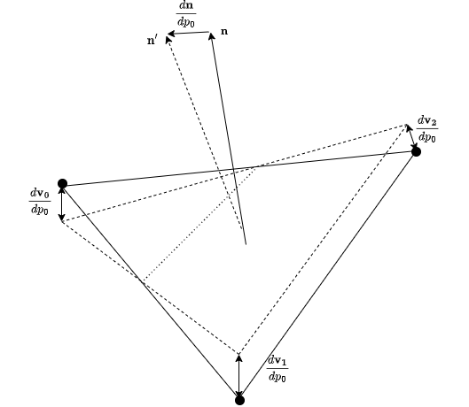

# PySAGAS Definitions

This page defines all symbols, terms and data types used by *PySAGAS*.


(nomenclature)=
## Nomenclature
The nomenclature used by *PySAGAS* is defined in the table below.

| Symbol | Description |
| ------ | ----------- |
| **v** | Vertex vector |
| **n** | Normal vector |
| **p** | Design parameters vector |
| P | Pressure |
| A | Area |


(cell-definition)=
## Cell Definition
A "Cell" in *PySAGAS* is a triangular element, defined by three 
unique vectors pointing to the cell's vertices, 
$\mathbf{v_0}, \mathbf{v_1}$ and $\mathbf{v_2}$. These vertices
form the corners of the triangular cell, and also form the face 
of the cell. This face has both an area $A$ and a normal vector
$\mathbf{n}$ associated with it. These properties are defined in
the figure below.

```{seealso}
The Cell definition shown below is consistent with the
{py:class}`.Cell` object.
```


(normal-area-vertex-sens)=
## Cell Normal and Area Sensitivities

<!-- TODO - update this section with links to code methods -->
<!-- should be called Cell normal and area sensitivities -->


Given the definition of a cell above, the sensitivities of the 
cell normal and the cell area to the cell's vertices can be
determined. That is, $\frac{d\mathbf{n}}{d\mathbf{v}}$ and 
$\frac{dA}{d\mathbf{v}}$, respectively. The figure below 
exemplifies how a cell's normal vector and area
changes with variations in one of its vertices, $\mathbf{v_2}$
to $\mathbf{v_2}'$.


These sensitivities can be calculated using analytical derivitives. 
The output of this is a matrix for each sensitivity, of the 
dimensionality shown below. 


```{seealso}
The calculations of $\frac{d\mathbf{n}}{d\mathbf{v}}$ and 
$\frac{dA}{d\mathbf{v}}$ are implemented in 
{py:meth}`.n_sensitivity` and {py:meth}`.A_sensitivity`,
respectively.
```


(geom-param-sens)=
## Geometric Parameter Sensitivities

Although users of *PySAGAS* are required to provide their own geometric
parameter sensitivities, the figure below may be insightful. To be clear,
a user must provide the sensitivity of each vertex defining a geometry
to the design parameters, that is, $\frac{d\mathbf{v}}{d\mathbf{p}}$. The 
diagram in the figure below illustrates a cell's vertices changing as a 
result of a change in a parameter $p_0$.



Given $\frac{d\mathbf{v}}{d\mathbf{p}}$, the sensitivity of both the cell
normals and cell areas to the deisgn parameters can be calculated using
the chain rule, as per the equations below.

$$
\frac{d\mathbf{n}}{d\mathbf{p}} = \frac{d\mathbf{n}}{d\mathbf{v}} \frac{d\mathbf{v}}{d\mathbf{p}}
$$


$$
\frac{dA}{d\mathbf{p}} = \frac{dA}{d\mathbf{v}} \frac{d\mathbf{v}}{d\mathbf{p}}
$$


