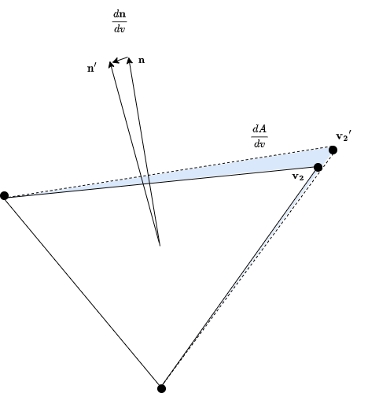

# PySAGAS Definitions

This page defines all symbols, terms and data types used by *PySAGAS*.


(nomenclature)=
## Nomenclature
The nomenclature used by *PySAGAS* is defined in the table below.

| Symbol | Description |
| ------ | ----------- |
| **v** | Vertex vector |
| **n** | Normal vector |
| **p** | Design parameters vector |
| P | Pressure |
| A | Area |


(cell-definition)=
## Cell Definition
A "Cell" in *PySAGAS* is a triangular element, defined by three 
unique vectors pointing to the cell's vertices, 
$\mathbf{v_0}, \mathbf{v_1}$ and $\mathbf{v_2}$. These vertices
form the corners of the triangular cell, and also form the face 
of the cell. This face has both an area $A$ and a normal vector
$\mathbf{n}$ associated with it. These properties are defined in
the figure below.

```{seealso}
The Cell definition shown below is consistent with the
[Cell](pysagas.geometry.Cell) object.
```


## Vertex Sensitivities

Given the definition of a [Cell](pysagas.geometry.Cell) above,
the cell vertex sensitivities can be defined. These sensitivities
include the cell normal/vertex sensitivity 
$\frac{d\mathbf{n}}{d\mathbf{v}}$, and the cell area/vertex 
sensitivity $\frac{dA}{d\mathbf{v}}$. 

The figure below illustrates how a cell's normal vector and area
changes with variations in one of its vertices, $\mathbf{v_2}$
to $\mathbf{v_2}'$.




These sensitivities are calculated using analytical derivitives. The 
output of this is a matrix for each sensitivity, of the dimensionality
shown below.


## Geometric Parameter Sensitivities

Although users of *PySAGAS* are required to provide their own geometric
parameter sensitivities, the figure below may be insightful. To be clear,
a user must provide the sensitivity of each vertex defining a geometry
to the design parameters, that is, $\frac{d\mathbf{v}}{d\mathbf{p}}$. The 
diagram in the figure below illustrates a cell's vertices changing as a 
result of a change in a parameter $p_0$.


Given $\frac{d\mathbf{v}}{d\mathbf{p}}$, the sensitivity of both the cell
normals and cell areas to the deisgn parameters can be calculated using
the chain rule, as per the equations below.

$$
\frac{d\mathbf{n}}{d\mathbf{p}} = \frac{d\mathbf{n}}{d\mathbf{v}} \frac{d\mathbf{v}}{d\mathbf{p}}
$$


$$
\frac{dA}{d\mathbf{p}} = \frac{dA}{d\mathbf{v}} \frac{d\mathbf{v}}{d\mathbf{p}}
$$


