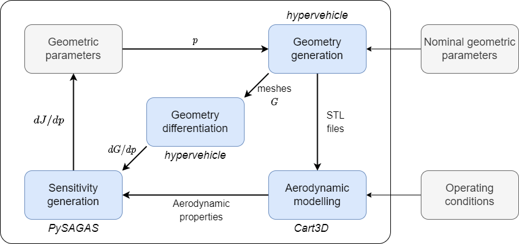
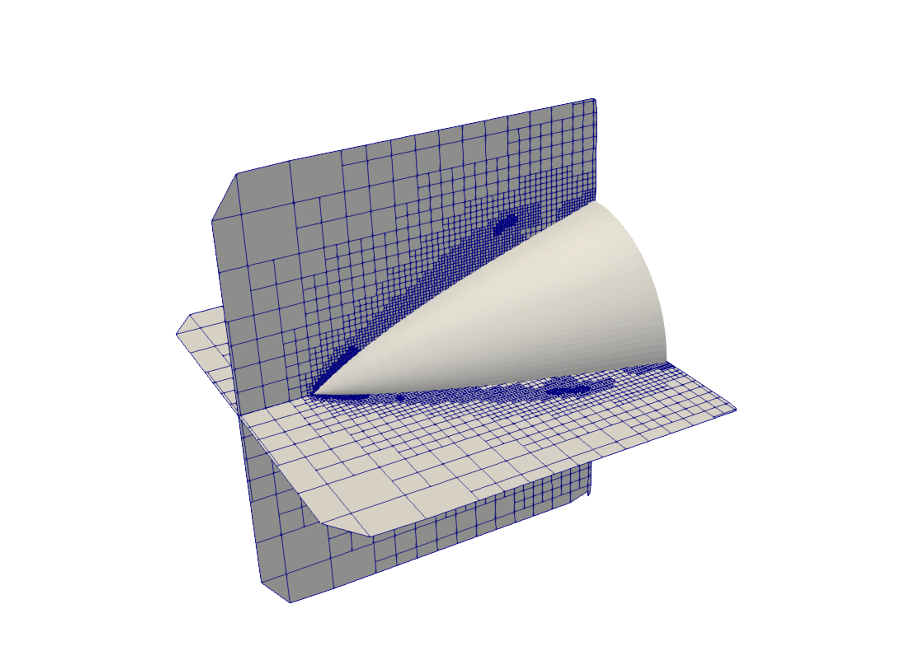
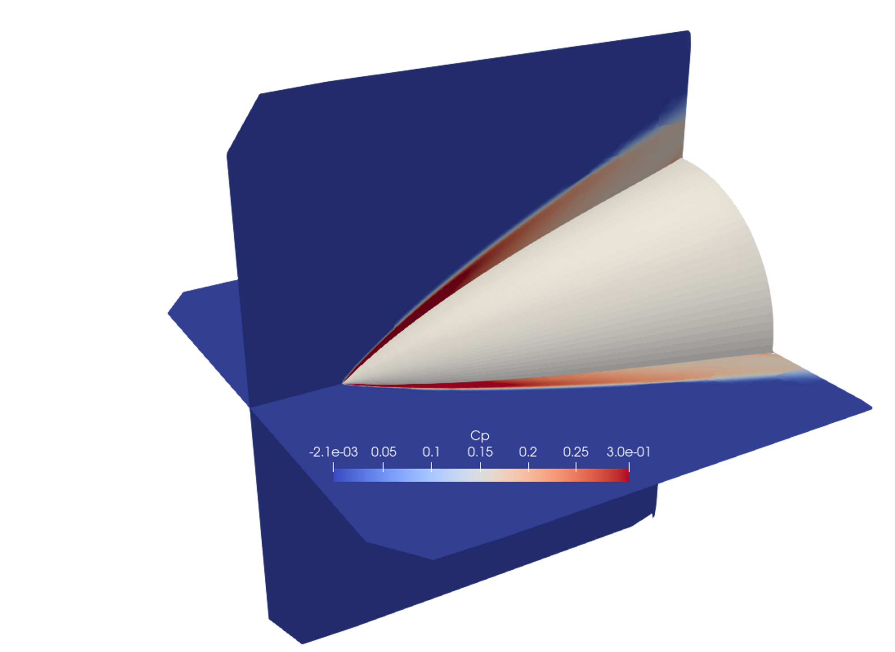
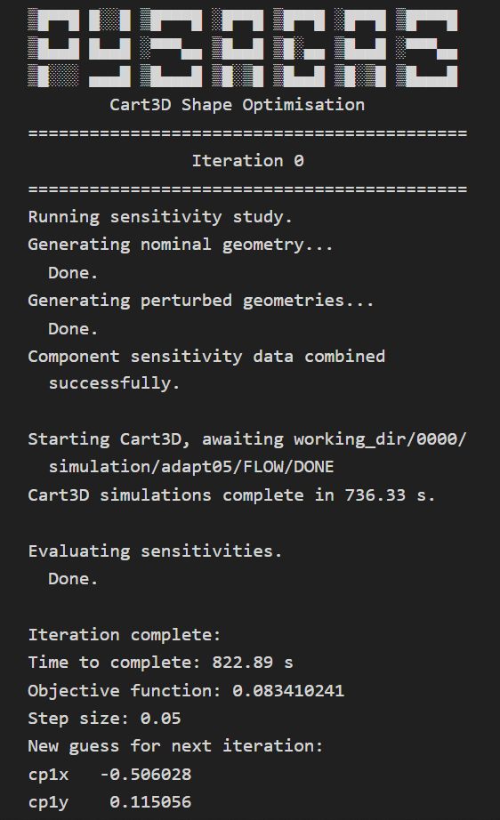
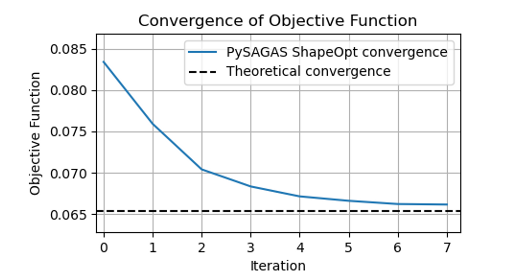
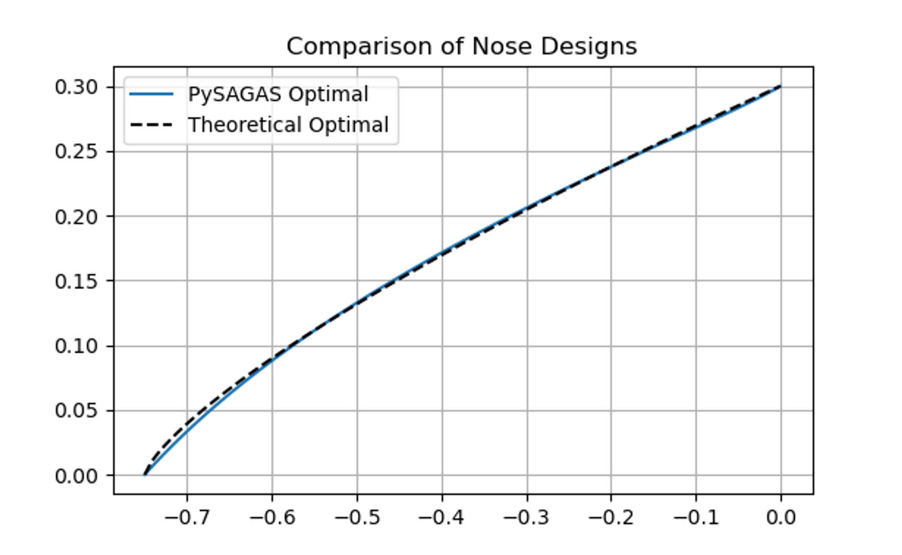

# Nose Cone Shape Optimisation
This page illustrates how *pysagas* can be used for design 
optimisation. The example is applied to a nose cone at an
operating point of Mach 6, 0 degrees angle-of-attack. 

## Literature Review

Sources [^1], [^2], [^3]

## Geometry Definition

## Optimisation Process

### Geometry Generation and Differentiation

Using [hypervehicle](http://github.com/kieran-mackle/hypervehicle/).

### Aerodynamic Modelling

## Results

The optimisation loop described above has been implemented in
`pysagas.optimisation.cartd.ShapeOpt`.

[^1]: [Eggers, A. J. Jr., Resnikoff, M. M., and Dennis, D. H., 
“Bodies of Revolution Having Minimum Drag at High Supersonic 
Airspeeds,” NACA-TR-1306, 1957.](https://ntrs.nasa.gov/citations/19930092299)

[^2]: [Perkins, E.W., Jorgensen, L. H., and Sommer, S. C., 
“Investigation of the Drag of Various Axially Symmetric Nose 
Shapes of Fineness Ratio 3 for Mach Numbers from 1.24 to 7.4,” 
NACA-TR-1386, 
1958.](https://ntrs.nasa.gov/citations/19930091022)

[^3]: [ W. H. Mason and Jaewoo Lee. “Minimum-drag axisymmetric 
bodies in the supersonic/hypersonic flow regimes”. In: Journal of
Spacecraft and 
Rockets 31.3 (1994)](https://arc.aiaa.org/doi/abs/10.2514/3.26453)

