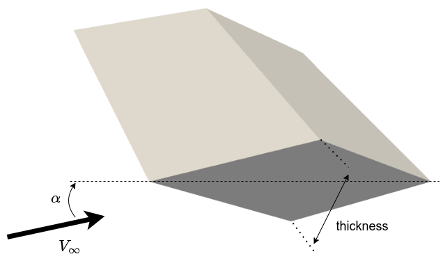
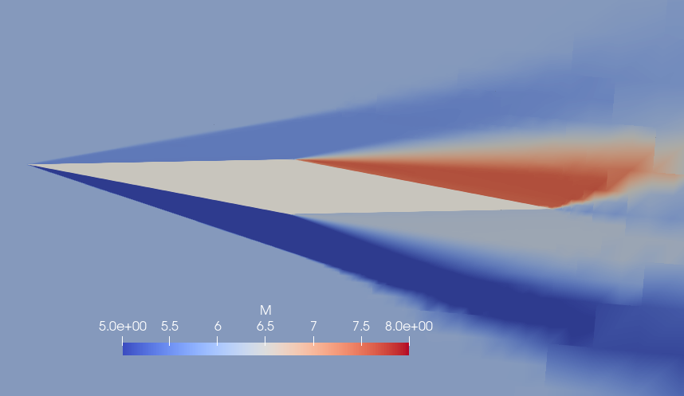

# Cart3D Sharp Wedge Study

This example highlights the use of *PySAGAS* on a 
CFD solution. Here, a diamond wedge geometry has 
been simulated in Cart3D, though the flow solution
from any solver could be used instead of Cart3D.

## Problem Defintion
The geometry for this example was generated using the 
parameteric geometry generation tool 
[hypervehicle](https://github.com/kieran-mackle/hypervehicle).
This tool provides the capability of generating cell vertex
sensitivities to geometric parameters. 

### Free Stream Conditions
The wedge is simulated at Mach 6, with a 3-degree angle of attack.
Since Cart3D is an inviscid flow solver, this is all that is required
to define the non-dimensional flow state.

### Parameterisation

To simplify this case study, a single parameter of wedge thickness
is used to alter the wedge geometry. 

## Cart3D Solution

 

### Parameter Sensitivities via Finite Differencing
Running a series of simulations in Cart3D for geometric 
perturbations of the wedge thickness about the nominal 
value, the following sensitiviites can be generated using
finite differencing. Note that the values are reported for
sensitivities in the non-dimensional coefficients 
$C_x, C_y$ and $C_z$.

|  Parameter $p$  | $dC_x/dp$ | $dC_y/dp$ | $dC_z/dp$ |
|-----------------|-----------|-----------|-----------|
| Thickness       |  0.14517  |  0.126153   |  0.0000  |

## PySAGAS Solution
Using the nominal geometry's Cart3D solution, the following
sensitivities can be generated using *PySAGAS*.
Note, the error of each sensitivitiy, as calculated using 
the Cart3D solution for reference, is shown in brackets.

|  Parameter $p$  | $dC_x/dp$ | $dC_y/dp$ | $dC_z/dp$ |
|-----------------|-----------|-----------|-----------|
| Thickness       |  0.15496 (5.0%) | 0.11912(-5.6%)  |  0.00312 (-) |

## Special Considerations

- Having a coarse geometry mesh will impact the accuracy of the
Cart3D solution. In terms of computational expense, there is little
reason to use a coarse geometry mesh, since this is loaded by Cart3D
just once. A coarse geometry mesh may also not accurately capture
the features of the geometry.
- The computational expense of *PySAGAS* scales with the number of 
cells which must be transcribed from the Cart3D solution, so the 
resolution of the geometry mesh should not be excessive.
