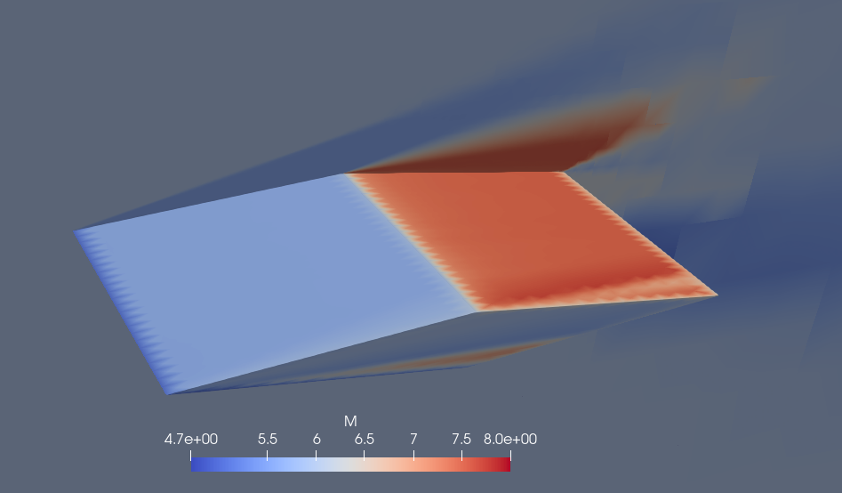

# Cart3D Sharp Wedge Study

This example highlights the use of PySAGAS on a 
CFD solution. Here, a diamond wedge geometry has 
been simulated in Cart3D, though the flow solution
from any solver could be used instead of Cart3D.

## Geometry Defintion
The geometry for this example was generated using the 
parameteric geometry generation tool 
[hypervehicle](https://github.com/kieran-mackle/hypervehicle).
This tool provides the capability of generating cell vertex
sensitivities to geometric parameters. 

### Parameterisation

To simplify this case study, a single parameter of wedge thickness
is used to alter the wedge geometry. 

## Cart3D Flow Solution

 

### Parameter Sensitivities via Finite Differencing

< Insert table of results from Cart3D >

## PySAGAS Parameter Sensitivities

< Insert table of results from Cart3D >

